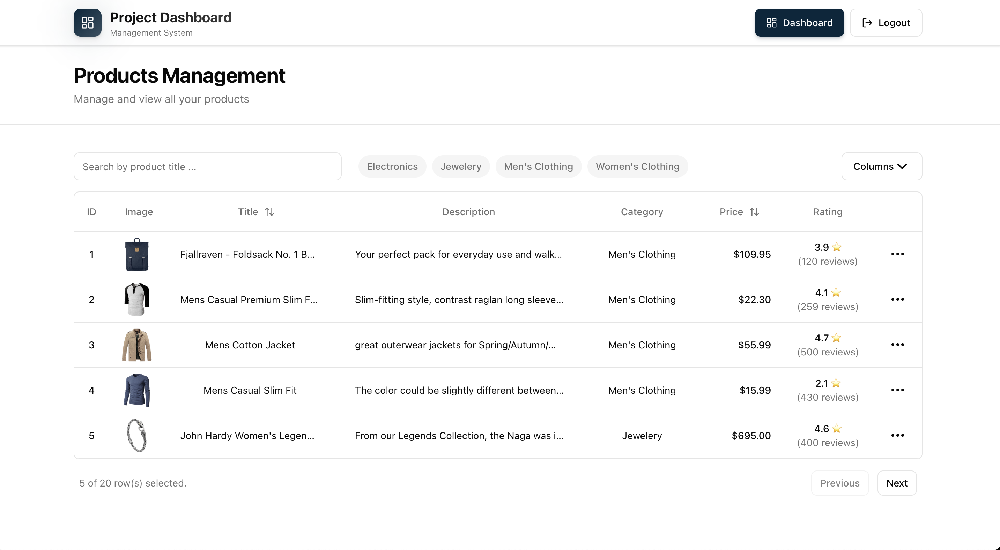

# Project Management Dashboard

<div align="center" >

</div>

## Project Description
here is a link to the project deployed on vercel <br/> <a href="https://project-managment-dashboard-1f4o.vercel.app/">Product-Dashboard</a> <br/>

- **Authenticate** - Simple login system (any email/password combination works for demo purposes)
- **View Products** - Browse products in a responsive, sortable table with pagination
- **Search & Filter** - Search products by title and filter by category
- **Edit Products** - Update product details (title, price, description, category) through a modal interface
- **Customize View** - Toggle column visibility to customize your table view
- **Responsive Design** - Modern UI built with Tailwind CSS that works on all screen sizes

### Tech Stack

- **React 19** - UI framework
- **TypeScript** - Type safety
- **Vite** - Build tool and dev server
- **React Router** - Client-side routing
- **TanStack Table** - Powerful data table with sorting, filtering, and pagination
- **Tailwind CSS** - Utility-first CSS framework
- **Axios** - HTTP client for API requests
- **FakeStore API** - Product data source

## Getting Started

### Prerequisites

Make sure you have the following installed on your system:

- **Node.js** (version 21 or higher)
- **npm** (comes with Node.js) or **yarn**

### Installation Steps
1. Clone the repo 
```sh
git clone https://github.com/SalmaaOsamaa/project-managment-dashboard.git
```

2. install dependenscies
 ```bash
  npm i 
  ```

3. **Start the development server**
   ```bash
   npm run dev
   ```

4. **Open your browser**
   
   Navigate to the URL shown in your terminal (typically `http://localhost:5173`)

### Available Scripts

- `npm run dev` - Start the development server with hot module replacement (HMR)
- `npm run build` - Build the application for production
- `npm run preview` - Preview the production build locally
- `npm run lint` - Run ESLint to check code quality

## Usage

### Authentication

1. Navigate to the login page (homepage)
2. Enter any email address and password (no real authentication required for this demo)
3. Click "Sign In" to access the dashboard

### Dashboard Features

- **Search Products**: Use the search input to filter products by title
- **Filter by Category**: Click on category chips to filter products by category
- **Sort Columns**: Click on column headers (Title, Price) to sort ascending/descending
- **Edit Product**: Click the three-dot menu (⋮) on any row and select "Edit"
- **Customize Columns**: Click the "Columns" button to show/hide table columns
- **Navigate Pages**: Use the "Previous" and "Next" buttons to navigate through paginated results
### Architecture Breakdown

For this project I used mainly Clean Architeture with some taste of hexagonal architecture to expose code units to be more testable

This is a draw of the main Skeleton:


this is a draw of how layers communicate:


and here's a details description of each layer:

**Domain/Domain models**: This layer contain interfaces that represent domain entities, and any domain specific logic in the form of pure functions

- Each domain entity in its own file.
- Index file that re-exports all the entities.
- Files outside this layer can only import entities from the index file.
- Any layer can import from this layer, except lib.
- This layer cannot import anything from other layers, as domain specific entities and logic should not depend on anything that’s not domain specific.

**lib**: This layer is for any domain agnostic logic. Think of it like this: it’s like a collection of packages that can be used in any application regardless of the business logic.

- Each function has its own file.
- No index file. As different functions in this layer are independent to each other, it’s meaningless to make an entry point to everything. Other layers can import from this layer through the direct file.
- Any layer can import from this layer.
- This layer cannot import from any other layer, as it contain domain agnostic functions, these functions cannot depend on any domain specific logic or any business logic defined in our app.

**Network**: This layer is for any communication over network, regardless of protocol. If caching, retry, or offline support logic is to be added, it should be added to this layer

- A single file can contain multiple function related to the same entity (the name of the file should be the name of the entity, plural, i.e users.ts).
- Index file that re-exports all the functions from all files.
- Only the UI layer can import from this layer.
- This layer can import from any other layer except the UI layer.

**UI**: Since our app’s logic is either to display data, or get data from the user and send it to the back-end, this layer is basically our business logic and UI layers merged together. And since the global store is tightly coupled with our UI layer - for reactivity - it’s also part of it.

- Our “features” are our pages. Although from a back-end point of view - or even from the user’s - that something like login and forgot password are different use-cases, if we have both scenarios in the same page, then from our POV they’re a single feature.
- Re-usability is prohibited between pages, and each page cannot import anything from other page. For any common logic or UI across pages, they should be duplicated. The rationale behind this is that 1- Multiple parts looking visually identical doesn’t mean they behavior is identical, and 2- Even if the behavior is identical now that doesn’t mean that any future changes should be implemented in all of the places. Duplicating the code give us the freedom of making any requested change to any part, without worrying about the impact of these changes in other places where the change is not required.
- The global store only has getters and setters. It should use any network functions, or contain any business logic, we’ll do that in the pages.
- Every page’s internal structure is up to the implementer. Make as many internal folders and files as necessary as long as they are required, internal, and adheres to our other standards.


## Build for Production

To create an optimized production build:

```bash
npm run build
```

The built files will be in the `dist/` directory, ready to be deployed to any static hosting service.

