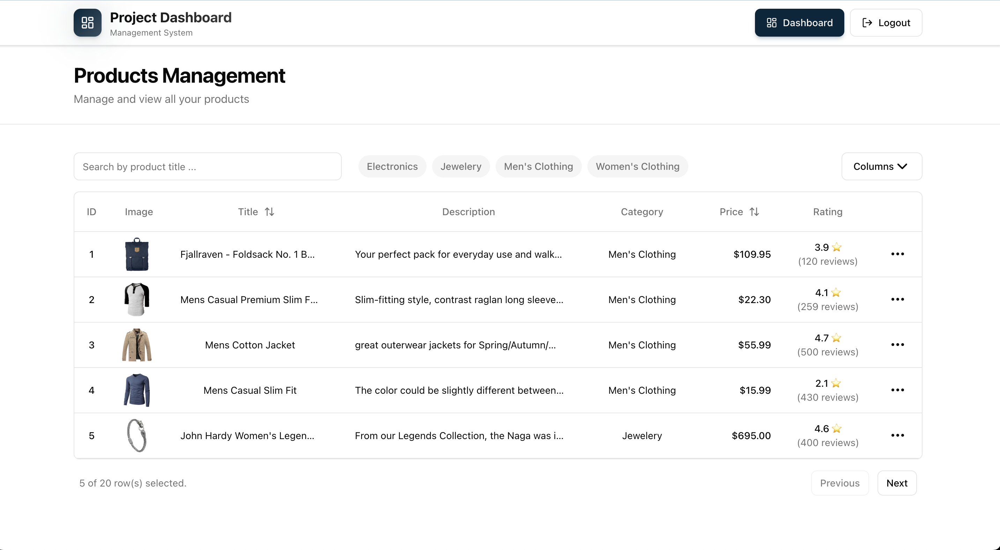

# Project Management Dashboard

<div align="center" >

</div>

## Project Description

This is a single-page application (SPA) that allows users to:

- **Authenticate** - Simple login system (any email/password combination works for demo purposes)
- **View Products** - Browse products in a responsive, sortable table with pagination
- **Search & Filter** - Search products by title and filter by category
- **Edit Products** - Update product details (title, price, description, category) through a modal interface
- **Customize View** - Toggle column visibility to customize your table view
- **Responsive Design** - Modern UI built with Tailwind CSS that works on all screen sizes

### Tech Stack

- **React 19** - UI framework
- **TypeScript** - Type safety
- **Vite** - Build tool and dev server
- **React Router** - Client-side routing
- **TanStack Table** - Powerful data table with sorting, filtering, and pagination
- **Tailwind CSS** - Utility-first CSS framework
- **Axios** - HTTP client for API requests
- **FakeStore API** - Product data source

## Getting Started

### Prerequisites

Make sure you have the following installed on your system:

- **Node.js** (version 16 or higher)
- **npm** (comes with Node.js) or **yarn**

### Installation Steps
1. Clone the repo 
```sh
git clone https://github.com/SalmaaOsamaa/project-managment-dashboard.git
```

2. install dependenscies
 ```bash
  npm i 
  ```

3. **Start the development server**
   ```bash
   npm run dev
   ```

4. **Open your browser**
   
   Navigate to the URL shown in your terminal (typically `http://localhost:5173`)

### Available Scripts

- `npm run dev` - Start the development server with hot module replacement (HMR)
- `npm run build` - Build the application for production
- `npm run preview` - Preview the production build locally
- `npm run lint` - Run ESLint to check code quality

## Usage

### Authentication

1. Navigate to the login page (homepage)
2. Enter any email address and password (no real authentication required for this demo)
3. Click "Sign In" to access the dashboard

### Dashboard Features

- **Search Products**: Use the search input to filter products by title
- **Filter by Category**: Click on category chips to filter products by category
- **Sort Columns**: Click on column headers (Title, Price) to sort ascending/descending
- **Edit Product**: Click the three-dot menu (⋮) on any row and select "Edit"
- **Customize Columns**: Click the "Columns" button to show/hide table columns
- **Navigate Pages**: Use the "Previous" and "Next" buttons to navigate through paginated results

## Project Structure

```
src/
├── components/          # Reusable UI components
│   ├── ui/             # UI primitives (Button, Input, Table, etc.)
│   ├── Header.tsx      # Page header component
│   └── Navbar.tsx      # Navigation bar
├── pages/              # Page components
│   ├── Auth/          # Authentication page
│   └── Dashboard/     # Dashboard page with product management
├── router/             # Routing configuration
├── network/            # API service layer
├── domain-models/      # TypeScript type definitions
├── utils/              # Utility functions
└── layouts/            # Layout components
```

## Build for Production

To create an optimized production build:

```bash
npm run build
```

The built files will be in the `dist/` directory, ready to be deployed to any static hosting service.

## License

This project is open source and available for personal and commercial use.
